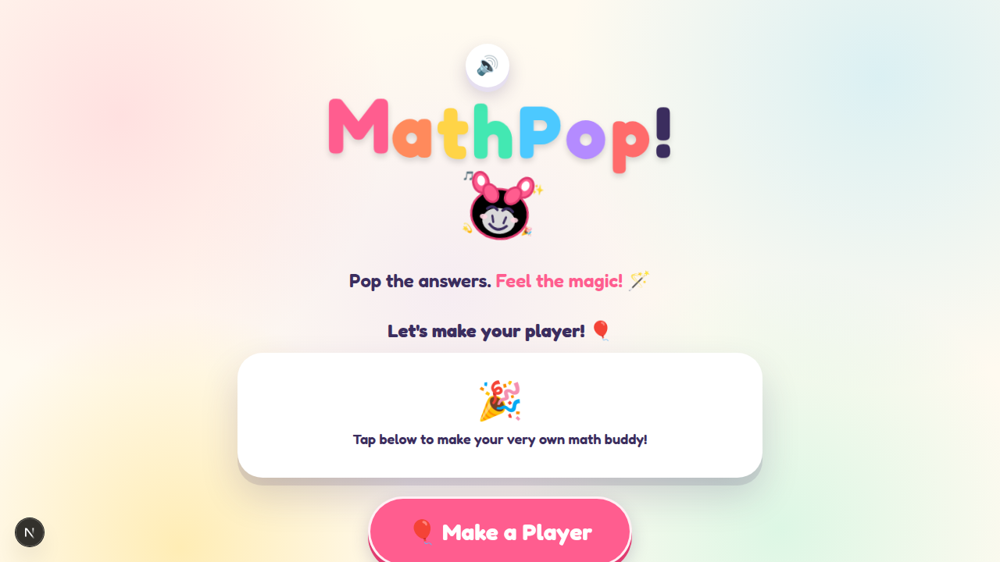
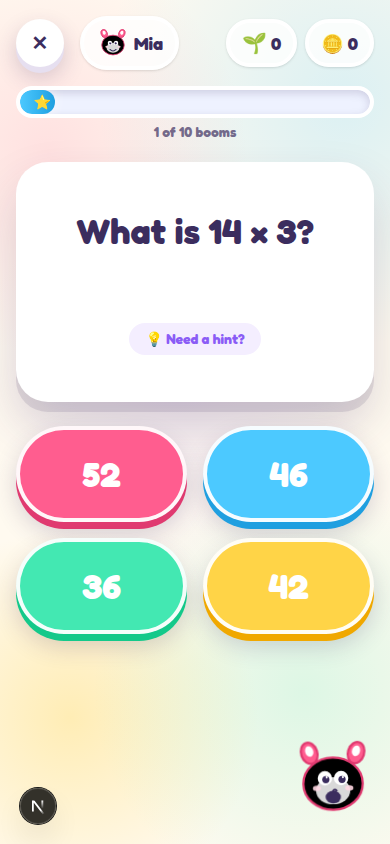

# PopSchool! 🎈

Pop the answers. **Feel the magic!** 🪄

PopSchool is a colorful, kid-friendly quiz game where players create their own learning buddy, pick an adventure, and pop through fast-paced rounds of questions across Math, English, Science, and Social studies.

## 📸 Screenshots

| Home & profiles | Quiz gameplay |
| --- | --- |
|  |  |

## ✨ Features

- **Multiple profiles** — each kid gets their own buddy (colorful mascot), name, coins, stars, streaks, and badges.
- **Three age bands** that adapt the question difficulty:
  - 🧸 **Playground** (ages 5–7)
  - 🚀 **Adventure** (ages 7–9)
  - 🏆 **Champion** (ages 9–12)
- **50+ topics** across four subjects: Math ➕, English 🔤, Science 🔬, Social 🌍.
- **Procedurally generated questions** — seeded RNG means every round is fresh but reproducible for testing.
- **Rewards & feedback** — coins, up to 3 stars per round, best streaks, and earned badges.
- **Big, tappable buttons** with chunky 3D depth — designed for small fingers on phones and tablets.
- **Sound effects** with a one-tap toggle 🔊/🔇 (Web Audio, no assets needed).
- **Delightful UI** — animated mascot, confetti, floating letters, springy transitions (framer-motion).

## 📱 Progressive Web App

- **Installable** — `InstallButton` surfaces the browser install prompt (or an iOS "Add to Home Screen" hint).
- **Works offline** — a hand-rolled service worker (`public/sw.js`) precaches the app shell, caches static assets, and keeps the last successful question round per topic for offline replay.
- **Offline-aware gameplay** — the game page watches `online`/`offline`, shows a friendly "You're offline 📶" screen, and auto-retries when the connection returns.

## 🧰 Tech Stack

| What | Why |
| --- | --- |
| [Next.js 16](https://nextjs.org) (App Router, Turbopack) | Pages, API routes, PWA metadata |
| [React 19](https://react.dev) | UI |
| [TypeScript](https://www.typescriptlang.org) | Type safety |
| [Tailwind CSS 4](https://tailwindcss.com) | Styling & design tokens |
| [framer-motion](https://www.framer.com/motion) | Animations |
| Web Audio API | Synthesized sound effects (no files) |
| localStorage | Profile, stats, and progress persistence |

## 🚀 Getting Started

```bash
npm install
npm run dev
```

Open [http://localhost:3000](http://localhost:3000). Pick or create a player, choose a topic, and start popping!

### Scripts

| Command | Description |
| --- | --- |
| `npm run dev` | Start the dev server (Turbopack) |
| `npm run build` | Production build + type check |
| `npm run start` | Serve the production build |
| `npm run lint` | Run ESLint |

## 🗺️ Project Structure

```
src/
├── app/
│   ├── api/
│   │   ├── questions/route.ts    # GET /api/questions?topic&band&difficulty&count&seed
│   │   └── topics/route.ts       # GET /api/topics (bands, subjects, topics, filters)
│   ├── play/
│   │   ├── page.tsx              # Topic picker (per band/subject)
│   │   └── [topic]/page.tsx      # The quiz game itself
│   ├── layout.tsx                # Root layout, fonts, PWA registration
│   ├── manifest.ts               # PWA web app manifest (icons, theme)
│   └── page.tsx                  # Home: profiles, install prompt
├── components/
│   ├── BigButton.tsx             # Chunky 3D toy-style button
│   ├── Confetti.tsx              # Celebration effect
│   ├── InstallButton.tsx         # PWA install / iOS hint
│   ├── Mascot.tsx                # The buddies (moods, colors, eyes)
│   ├── ProgressBar.tsx           # Round progress
│   ├── PwaRegister.tsx           # Service worker registration
│   ├── SoundProvider.tsx         # Sound on/off context
│   └── Stars.tsx                 # Star rating display
├── lib/
│   ├── audio/sound.ts            # Web Audio synthesized sound effects
│   ├── math/                     # Math question generators + topics
│   ├── quiz/                     # English / Science / Social question banks
│   └── storage/profiles.ts       # Profiles, stats, badges, round recording
public/
├── icons/                        # PWA icons (192, 512, maskable, apple-touch)
└── sw.js                         # Hand-rolled service worker
```

## 🔌 API

### `GET /api/questions`

Procedurally generates a round of questions.

| Query | Default | Description |
| --- | --- | --- |
| `topic` | — (required) | Topic id, e.g. `addition`, `fractions`, `space` |
| `band` | `m` | `k` (5–7), `m` (7–9), or `e` (9–12) |
| `difficulty` | `1` | 1–10, scales question range/complexity |
| `count` | `10` | Number of questions (1–20) |
| `seed` | now | Seeded RNG for reproducible batches |

```json
{
  "topic": "addition",
  "band": "m",
  "difficulty": 1,
  "questions": [
    { "prompt": "What is 3 + 4?", "choices": [5, 6, 7, 8], "answer": 7 }
  ]
}
```

### `GET /api/topics`

Lists bands, subjects, and topics. Optional `band` and/or `subject` filters narrow the result. Unknown topics return a `400`.

## 🎮 How to Play

1. **Make a player** — give your buddy a name, pick a color, and choose an adventure band.
2. **Pick a topic** — browse subjects and topics suited to your band.
3. **Pop answers** — tap the correct bubble before the clock/streak pressure builds. Wrong pops teach you the right answer.
4. **Earn rewards** — coins per correct answer, bonus coins for a perfect round or a 5+ streak, and up to 3 stars per topic.

## 🛠️ Development Notes

- New question banks live in `src/lib/quiz/` (`bank.ts`, `english.ts`, `science.ts`, `social.ts`) — one file per subject, keyed by topic id.
- New math topic types go in `src/lib/math/generators.ts` and `src/lib/math/types.ts`.
- Topics are registered in `src/lib/math/topics.ts` with their band range and emoji/colors.
- Profiles persist in `localStorage` under keys managed by `src/lib/storage/profiles.ts`.
- The service worker uses versioned caches (`popschool-static-*`, `popschool-shell-*`, `popschool-rounds-*`); bump `SW_VERSION` in `public/sw.js` to bust stale caches after a deploy.

## 📄 License

Made with 💖 for brilliant kids everywhere.
